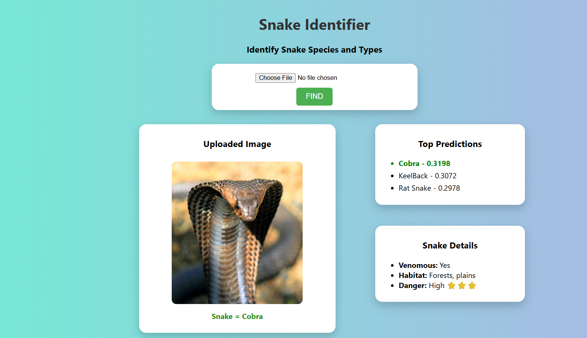

# 🐍 Snake Identification System

A **Flask-based Snake Identification System** that uses **deep learning feature extraction and image similarity** to identify snake species from an uploaded image.

The system uses **MobileNetV2 with PyTorch** to extract visual features from snake images and **cosine similarity** to compare the uploaded image with the stored feature representations.

> ⚠️ **Disclaimer:** This project is intended for educational and demonstration purposes only. It should not be used to determine whether a snake is venomous or to make safety-critical decisions.

---

## ✨ Features

* 🐍 Identify snake species from an uploaded image
* 📷 Simple image upload interface
* 🧠 Deep-learning-based feature extraction using MobileNetV2
* 🔍 Image comparison using cosine similarity
* ⚡ Flask web application
* 📊 Displays information about the identified snake
* 🖥️ Simple and responsive web interface
* 📁 Supports multiple snake species

---
## 📸 Website Preview

###  Website Preview and Prediction Results





---

## 🛠️ Tech Stack

### Backend

* Python
* Flask

### Machine Learning

* PyTorch
* Torchvision
* MobileNetV2
* Scikit-learn
* NumPy

### Image Processing

* Pillow

### Frontend

* HTML
* CSS
* Jinja2

---

## 🧠 How It Works

The system follows a feature-extraction and similarity-based approach.

### Workflow

```text
             Upload Snake Image
                     │
                     ▼
              Flask Web App
                     │
                     ▼
              Image Preprocessing
                     │
                     ▼
             MobileNetV2 Model
                     │
                     ▼
           Feature Vector Extraction
                     │
                     ▼
           Cosine Similarity Search
                     │
                     ▼
             Best Matching Species
                     │
                     ▼
             Snake Information
```

### Step 1 — Image Upload

The user uploads an image of a snake through the web interface.

### Step 2 — Image Preprocessing

The uploaded image is resized and transformed into the format required by the MobileNetV2 model.

### Step 3 — Feature Extraction

A pretrained **MobileNetV2** model is used as a feature extractor.

Instead of directly using the model for classification, the system extracts a numerical representation of the image.

### Step 4 — Similarity Comparison

The extracted feature vector is compared with previously generated feature vectors using **cosine similarity**.

### Step 5 — Prediction

The system selects the closest matching feature representation and returns the corresponding snake species.

---

## 📂 Project Structure

```text
Snake_Identification/
│
├── app.py
├── requirements.txt
├── .gitignore
├── README.md
│
├── models/
│   └── snake_model.pkl
│
├── static/
│   └── style.css
│
├── templates/
│   └── index.html
│
├── test_images/
│
├── utils/
│   ├── model_utility.py
│   ├── save_features.py
│   └── snakes_details.py
│
└── scripts/
    └── model_testing.py
```

> The original dataset and generated feature files are excluded from the GitHub repository because of their size.

---

## ⚙️ Installation

### 1. Clone the repository

```bash
git clone https://github.com/YOUR_USERNAME/Snake_Identification.git
```

### 2. Navigate to the project directory

```bash
cd Snake_Identification
```

### 3. Create a virtual environment

```bash
python -m venv venv
```

### 4. Activate the virtual environment

**Windows PowerShell:**

```powershell
venv\Scripts\Activate.ps1
```

**Windows CMD:**

```cmd
venv\Scripts\activate
```

### 5. Install dependencies

```bash
pip install -r requirements.txt
```

---

## ▶️ Running the Application

Start the Flask application:

```bash
python app.py
```

The terminal will provide the local development address.

Open it in your browser and upload a snake image to test the system.

---

## 📊 Dataset

**The dataset used is completely self made for initial model Training and Checking Purposes.**

The project was developed using a dataset containing images of different snake species.

The dataset is **not included in this repository** because of its size.

To reproduce the feature-extraction process:

1. Obtain the required snake image dataset.
2. Organize the images according to the expected folder structure.
3. Run the feature extraction script:

```bash
python utils/save_features.py
```

This generates the feature representations used by the identification system.

---

## 🔍 Example

```text
Input
  ↓
Snake Image
  ↓
MobileNetV2 Feature Extraction
  ↓
Feature Vector
  ↓
Cosine Similarity
  ↓
Closest Match
  ↓
Snake Species + Information
```

---

## 🚧 Limitations

* Identification accuracy depends heavily on the quality and diversity of the dataset.
* Images with poor lighting, unusual angles, occlusion, or low resolution may produce incorrect results.
* Similar-looking species can be difficult to distinguish.
* The system should not be considered a reliable tool for real-world snake identification or safety decisions.

---

## 🔮 Future Improvements

* [ ] Increase the number and diversity of snake species
* [ ] Improve the training dataset
* [ ] Add confidence/similarity scores
* [ ] Improve image preprocessing
* [ ] Experiment with fine-tuning pretrained models
* [ ] Add more detailed snake information
* [ ] Deploy the application online
* [ ] Improve the UI/UX
* [ ] Add an API endpoint for image prediction

---

## 👨‍💻 Author

**Kishan Kumar**

Python Developer | AI/ML Enthusiast

---

## 📜 License

This project is intended for educational and learning purposes.
